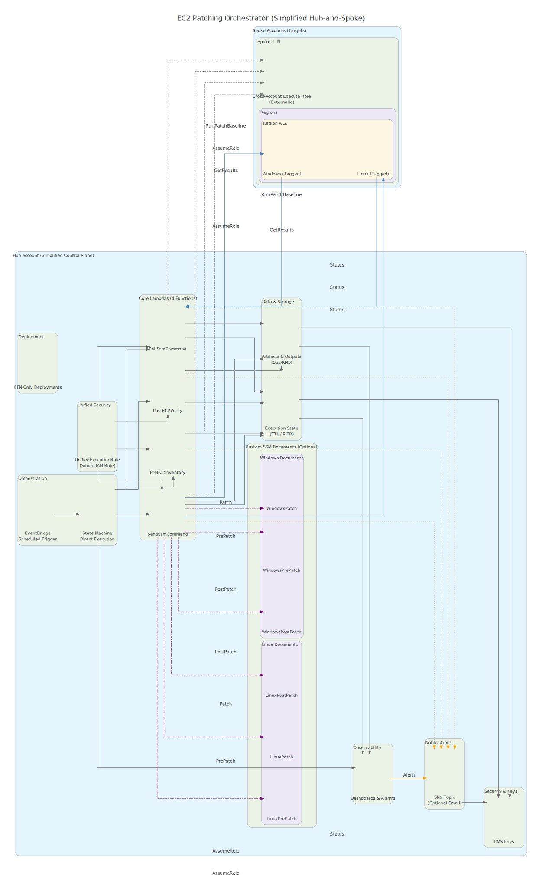

# 🔧 Enterprise EC2 Multi-Account Patching Platform

Production-grade EC2 patching orchestration for 100s of AWS accounts (2k+ instances)

[](https://aws.amazon.com/cloudformation/)
[](https://aws.amazon.com/)
[](https://www.python.org/)
[](https://opensource.org/licenses/MIT)

## 🏆 Enterprise-Grade EC2 Patching Orchestration

This platform deploys a **production-grade** EC2 patching orchestrator using a hub-and-spoke architecture for 100s of AWS accounts (scales to thousands of instances) with automated patching workflows, manual approval gates, and comprehensive monitoring. It is implemented with pure AWS CloudFormation (no Terraform/SAM; no Bedrock/X-Ray).

## Table of Contents

- [Architecture Overview](#architecture-overview)
- [Architecture Diagram](#architecture-diagram)
- [Pre-Prod Checklist](#pre-prod-checklist)
- [Runbook: Deploy and Operate](#runbook-deploy-and-operate)
- [Configuration](#configuration)
- [Security](#security)
- [API Reference](#api-reference)
- [Monitoring](#monitoring)
- [Troubleshooting](#troubleshooting)
- [Contributing](#contributing)
- [Support](#support)
- [Ops Runbook](docs/runbook-operations.md)
- [CI/CD](#cicd)

## Architecture Overview

```text
┌─────────────────────────────────────────────────────────────────┐
│                        HUB ACCOUNT                              │
│                  (Orchestration Control Plane)                 │
│  ┌─────────────────┐  ┌───────────────────┐  ┌───────────────┐ │
│  │   EventBridge   │  │ Step Functions    │  │   Lambda      │ │
│  │   (Scheduler)   │◄─┤   Orchestrator    │◄─┤   Processors  │ │
│  │                 │  │                   │  │               │ │
│  └─────────────────┘  └───────────────────┘  └───────────────┘ │
│           │                      │                      │       │
│           │                                            │       │
│  ┌────────▼────────┐  ┌─────────────────┐  ┌──────────▼──────┐ │
│  │   CloudWatch    │  │      SNS        │  │   DynamoDB      │ │
│  │   Dashboard     │  │   Notifications │  │   State Store   │ │
│  └─────────────────┘  └─────────────────┘  └─────────────────┘ │
└─────────────────────────────────┬───────────────────────────────┘
                                  │ Cross-Account AssumeRole
                                  │
          ┌───────────────────────┼───────────────────────┐
          │                       │                       │
┌─────────▼─────────┐    ┌────────▼────────┐    ┌────────▼────────┐
│  SPOKE ACCOUNT 1  │    │  SPOKE ACCOUNT 2 │    │ SPOKE ACCOUNT N │
│                   │    │                  │    │                 │
│ ┌───────────────┐ │    │ ┌──────────────┐ │    │ ┌─────────────┐ │
│ │  Cross-Account│ │    │ │Cross-Account │ │    │ │Cross-Account│ │
│ │  Exec Role    │ │    │ │ Exec Role    │ │    │ │ Exec Role   │ │
│ └───────────────┘ │    │ └──────────────┘ │    │ └─────────────┘ │
│ ┌───────────────┐ │    │ ┌──────────────┐ │    │ ┌─────────────┐ │
│ │   EC2         │ │    │ │    EC2       │ │    │ │    EC2      │ │
│ │   Instances   │ │    │ │  Instances   │ │    │ │  Instances  │ │
│ │   (Tagged)    │ │    │ │  (Tagged)    │ │    │ │  (Tagged)   │ │
│ └───────────────┘ │    │ └──────────────┘ │    │ └─────────────┘ │
└───────────────────┘    └──────────────────┘    └─────────────────┘
```

### Key Components

- **🎯 Hub Account**: Centralized orchestration with Step Functions workflow
- **🔄 Spoke Accounts**: Target accounts with cross-account execution roles
- **📅 Wave Management**: Account grouping with scheduled maintenance windows
- **📦 Pure CFN**: No Terraform, SAM, Bedrock or X-Ray required
- **✅ Approval Gates**: Manual approval workflow with SNS notifications
- **📊 Monitoring**: Real-time dashboards and alerting

## Architecture Diagram

Rendered AWS icon diagram of the solution:



If your viewer doesn't render SVG, use the PNG: [docs/diagrams/architecture.png](docs/diagrams/architecture.png)

To update the diagram, regenerate both SVG and PNG following `docs/diagrams/README.md` and commit the outputs.

## Pre-Prod Checklist

Use this quick checklist before your first production run:

- Accounts & Roles
  - [ ] Spoke cross-account role deployed with correct ExternalId and trust to the hub
  - [ ] CI/CD deploy role permissions verified; OIDC configured
- Artifacts & Parameters
  - [ ] Lambda artifact uploaded to S3; parameters reference correct bucket/key
  - [ ] CloudFormation parameter JSONs set per env (concurrency, SSM MaxConcurrency/MaxErrors, log retention)
- Limits & Concurrency
  - [ ] Step Functions Map concurrency set for waves/accounts/regions
  - [ ] Lambda reserved concurrency for hot paths (send/poll/approval)
  - [ ] SSM Run Command limits align with account/region quotas
- Security & Compliance
  - [ ] KMS keys and policies validated for S3/DynamoDB/SNS
  - [ ] TLS-only S3 bucket policy enabled; DDB PITR and TTL configured
- Observability
  - [ ] CloudWatch dashboards deployed; alarms hooked to your notification channel
  - [ ] Log retention configured per your policy
- Dry Run
  - [ ] Execute a small canary wave (single account/region) and confirm approval and SSM outputs

See also: Operations Runbook in `docs/runbook-operations.md`.

## Runbook: Deploy and Operate

Quick actions:

[Run single scenario](../../actions/workflows/patch-canary.yml) · [Run multi-scenario matrix](../../actions/workflows/patch-matrix.yml)

[](https://github.com/deepak-kumar-biswal/ec2-patching-workflow/actions/workflows/patch-canary.yml)
[](https://github.com/deepak-kumar-biswal/ec2-patching-workflow/actions/workflows/patch-matrix.yml)

Tip: When dispatching the matrix workflow, you can point to a custom directory by setting the input `inputs_prefix` (for example `examples/custom-inputs/`) and listing scenarios (for example `wave-canary-east,wave-main-multi`).

### StartExecution input contract (copy/paste)

Use this as a template when starting the Step Functions execution. Adjust waves, accounts, regions, tags, and SSM knobs to suit your window.

```json
{
  "waves": [
    {
      "name": "canary",
      "accounts": ["111111111111", "222222222222"],
      "regions": ["us-east-1"],
      "filters": {
        "tags": { "PatchGroup": ["default"] },
        "platforms": ["Linux", "Windows"]
      },
      "ssm": {
        "maxConcurrency": "10%",
        "maxErrors": "1",
        "operation": "Install",
        "rebootOption": "RebootIfNeeded"
      }
    }
  ]
}
```

Example (AWS CLI) to pass accounts and input JSON:

```powershell
# Save your input as run-input.json (see template above)
aws stepfunctions start-execution \
  --state-machine-arn arn:aws:states:us-east-1:<HUB_ACCOUNT>:stateMachine:<NAME_PREFIX>-orchestrator \
  --name ec2patch-$(Get-Date -Format yyyyMMdd-HHmmss) \
  --input file://run-input.json
```

Notes:

- Only accounts with the spoke role deployed can be targeted; others will safely fail to assume role.
- To split by OS, set `filters.platforms` to `["Linux"]` or `["Windows"]`, or use PatchGroup tags.
- You can override `ssm.maxConcurrency`/`maxErrors` per wave to tune blast radius.

For day-2 operations and incident handling, see the Ops Runbook: `docs/runbook-operations.md`.

### More scenarios: ready-to-use inputs

Pick one of these inputs and adjust IDs/regions/tags. We’ve committed them under `examples/run-inputs/` so you can use them directly.

- Canary, single account/region: `examples/run-inputs/canary-small.json`
- Windows-only, multi-account, multi-region: `examples/run-inputs/windows-only-multi-region.json`
- Linux-only by tags (prod web/app), no reboot: `examples/run-inputs/linux-by-tags.json`
- Two waves (canary → main), different SSM knobs: `examples/run-inputs/multi-wave-staggered.json`
- Dry run (scan only), no reboot: `examples/run-inputs/scan-no-reboot.json`

Run examples

```powershell
# PowerShell (dynamic name)
aws stepfunctions start-execution \
  --state-machine-arn arn:aws:states:us-east-1:<HUB_ACCOUNT>:stateMachine:<NAME_PREFIX>-orchestrator \
  --name ec2patch-$(Get-Date -Format yyyyMMdd-HHmmss) \
  --input file://examples/run-inputs/canary-small.json
```

```cmd
:: Windows cmd (simple static name; make it unique per run)
aws stepfunctions start-execution --state-machine-arn arn:aws:states:us-east-1:<HUB_ACCOUNT>:stateMachine:<NAME_PREFIX>-orchestrator --name ec2patch-manual-001 --input file://examples\run-inputs\canary-small.json
```

Use a custom inputs directory with the matrix workflow:

```text
Inputs prefix: examples/custom-inputs/
Scenarios: wave-canary-east,wave-main-multi
```

Then run the matrix workflow and set:

- inputs_prefix = examples/custom-inputs/
- scenarios = wave-canary-east,wave-main-multi

### Who calls the Step Function? How do we pass JSON?

You have three common options. All of them pass the same JSON payload shown above.

1. On-demand (CLI/SDK/Console)

- AWS Console: Open the state machine → Start execution → paste JSON.
- AWS CLI/SDK: Use `start-execution` with `--input file://...` as shown.

1. CI/CD (GitHub Actions with OIDC)

Minimal job example:

```yaml
name: patch-canary
on: workflow_dispatch
jobs:
  run:
    runs-on: ubuntu-latest
    permissions:
      id-token: write     # for OIDC
      contents: read
    steps:
      - uses: actions/checkout@v4
      - uses: aws-actions/configure-aws-credentials@v4
        with:
          role-to-assume: arn:aws:iam::<HUB_ACCOUNT>:role/<DeployOrchestratorRole>
          aws-region: us-east-1
      - name: Start execution
        run: |
          aws stepfunctions start-execution \
            --state-machine-arn arn:aws:states:us-east-1:<HUB_ACCOUNT>:stateMachine:<NAME_PREFIX>-orchestrator \
            --name ec2patch-${{ github.run_id }} \
            --input file://examples/run-inputs/canary-small.json
```

1. Scheduled (EventBridge)

You can schedule patch waves on a cron using either EventBridge Scheduler (recommended) or a classic EventBridge Rule (CloudWatch Events). Both support passing JSON input.

- EventBridge Scheduler (recommended)

```yaml
Resources:
  PatchMonthly:
    Type: AWS::Scheduler::Schedule
    Properties:
      Name: ec2patch-monthly
      ScheduleExpression: 'cron(0 5 ? * SUN#1 *)'  # First Sunday 05:00 UTC
      FlexibleTimeWindow:
        Mode: OFF
      Target:
        Arn: arn:aws:states:us-east-1:<HUB_ACCOUNT>:stateMachine:<NAME_PREFIX>-orchestrator
        RoleArn: arn:aws:iam::<HUB_ACCOUNT>:role/<SchedulerInvokeRole>
        Input: |
          { "waves": [
            { "name": "wave1",
              "accounts": ["111111111111"],
              "regions": ["us-east-1"],
              "filters": { "tags": { "PatchGroup": ["default"] }, "platforms": ["Linux","Windows"] },
              "ssm": { "maxConcurrency": "10%", "maxErrors": "1", "operation": "Install", "rebootOption": "RebootIfNeeded" }
            }
          ]}
```

- EventBridge Rule (classic)

```yaml
Resources:
  PatchWindowRule:
    Type: AWS::Events::Rule
    Properties:
      Name: ec2patch-window
      ScheduleExpression: 'cron(0 5 ? * SUN#1 *)'
      State: ENABLED
      Targets:
        - Id: StartPatchOrchestrator
          Arn: arn:aws:states:us-east-1:<HUB_ACCOUNT>:stateMachine:<NAME_PREFIX>-orchestrator
          RoleArn: arn:aws:iam::<HUB_ACCOUNT>:role/<EventsInvokeRole>
          Input: |
            { "waves": [
              { "name": "wave1",
                "accounts": ["111111111111"],
                "regions": ["us-east-1"],
                "filters": { "tags": { "PatchGroup": ["default"] }, "platforms": ["Linux","Windows"] },
                "ssm": { "maxConcurrency": "10%", "maxErrors": "1", "operation": "Install", "rebootOption": "RebootIfNeeded" }
              }
            ]}
```

Notes

- Ensure the invoke role used by Scheduler/Events has `states:StartExecution` permission on the state machine.
- Input must be valid JSON (escape quotes if inlined into YAML). Keep it under service limits (≤ 256 KB).
- For advanced templating, use InputTransformer or Scheduler time-based tokens if needed.
- See `cloudformation/scheduler-example.yaml` for a parameterized Scheduler you can deploy as-is.
- Prefer a GitHub-driven run? Use `.github/workflows/patch-canary.yml` and choose a scenario from `examples/run-inputs/`.

#### Minimal IAM for Invoke Role

Trust policy (allow EventBridge Scheduler/Events to assume the role):

```json
{
  "Version": "2012-10-17",
  "Statement": [
    {
      "Effect": "Allow",
      "Principal": {
        "Service": [
          "scheduler.amazonaws.com",
          "events.amazonaws.com"
        ]
      },
      "Action": "sts:AssumeRole"
    }
  ]
}
```

Permissions policy (allow starting the specific state machine):

```json
{
  "Version": "2012-10-17",
  "Statement": [
    {
      "Effect": "Allow",
      "Action": [
        "states:StartExecution"
      ],
      "Resource": "arn:aws:states:us-east-1:<HUB_ACCOUNT>:stateMachine:<NAME_PREFIX>-orchestrator"
    }
  ]
}
```

### Prerequisites

- AWS CLI v2 configured
- OIDC-enabled GitHub roles (for CI/CD)
- SSM Agent on target EC2 instances
- Instances tagged with `PatchGroup=default`

### 1) Package Lambdas and Upload

Use GitHub Actions (recommended) to zip handlers in `lambda/`, upload to S3, and deploy CFN with parameter JSONs.

Manual alternative:

```bash
python -m pip install -r requirements-dev.txt
powershell -Command "Compress-Archive -Path ec2-patching-workflow/lambda/* -DestinationPath lambda.zip"
aws s3 cp lambda.zip s3://<artifact-bucket>/<key-prefix>/lambda.zip
```

### 2) Deploy Hub Stack (CloudFormation)

```bash
aws cloudformation deploy \
  --stack-name ec2patch-hub \
  --template-file cloudformation/hub-cfn.yaml \
  --parameter-overrides file://params/hub.dev.json \
  --capabilities CAPABILITY_IAM CAPABILITY_NAMED_IAM
```

### 3) Deploy Spoke Stacks

```bash
aws cloudformation deploy \
  --stack-name ec2patch-spoke \
  --template-file cloudformation/spoke-cfn.yaml \
  --parameter-overrides file://params/spoke.<account>.json \
  --capabilities CAPABILITY_IAM CAPABILITY_NAMED_IAM
```

### 4) Verify Deployment

```bash
aws stepfunctions list-state-machines --query 'stateMachines[?contains(name,`ec2patch`)]'
aws events list-rules --name-prefix ec2patch
aws sts assume-role --role-arn arn:aws:iam::SPOKE_ACCOUNT:role/PatchExecRole --role-session-name test-session
```

## Configuration

### Hub Stack Parameters (CloudFormation)

| Parameter | Type | Description | Example |
|----------|------|-------------|---------|
| `name_prefix` | string | Resource naming prefix | `ec2patch` |
| `artifact_bucket` | string | S3 bucket for lambda.zip | `my-artifacts` |
| `artifact_key` | string | S3 key for lambda.zip | `ec2patch/<sha>/lambda.zip` |
| `cross_account_external_id` | string | ExternalId for spoke trust | `ext-1234` |
| `poll_interval_seconds` | number | Poll loop interval seconds | `15` |
| `max_wave_concurrency` | number | Parallel accounts per wave | `5` |
| `ssm_max_concurrency` | string | SSM MaxConcurrency | `10%` |
| `ssm_max_errors` | string | SSM MaxErrors | `1%` |
| `notification_email` | string | Optional SNS email subscription | `ops@company.com` |

### Wave Configuration

- Define `accountWaves` in your Step Functions input or schedule rules.
- Use `wavePauseSeconds` for gaps between waves and `abortOnIssues` to stop on issues.

### Spoke Stack Parameters (CloudFormation)

| Parameter | Type | Description | Example |
|----------|------|-------------|---------|
| `hub_account_id` | string | Hub/orchestrator account ID | `111111111111` |
| `external_id` | string | ExternalId trusted by hub | `ext-1234` |
| `role_name` | string | Cross-account role name | `PatchExecRole` |

### Instance Tagging Requirements

```bash
# Required tags for EC2 instances
PatchGroup=default           # Patch group identifier
Environment=production       # Environment classification
MaintenanceWindow=standard   # Maintenance window type
CriticalityLevel=high       # Business criticality
```

## Security

### Supported AWS Services

- ✅ **Systems Manager** - Patch orchestration and compliance
- ✅ **EventBridge** - Scheduled maintenance windows
- ✅ **Step Functions** - Workflow orchestration
- ✅ **Lambda** - Custom processing logic
- ✅ **SNS** - Notification and queueing
- ✅ **CloudWatch** - Monitoring and alerting
- ✅ **DynamoDB** - State management
- ✅ **S3** - Artifact storage
- ✅ **KMS** - Encryption for S3/DDB/SNS
- ✅ **IAM** - Cross-account security

### Cross-Account Security Model

```json
{
  "Version": "2012-10-17",
  "Statement": [
    {
      "Effect": "Allow",
      "Principal": {
        "AWS": "arn:aws:iam::HUB_ACCOUNT:role/PatchOrchestratorRole"
      },
      "Action": "sts:AssumeRole",
      "Condition": {
        "StringEquals": {
          "sts:ExternalId": "unique-external-id"
        }
      }
    }
  ]
}
```

## API Reference

### Step Functions API

#### Start Execution

```bash
aws stepfunctions start-execution \
  --state-machine-arn arn:aws:states:region:account:stateMachine:ec2patch-orchestrator \
  --name "manual-patch-$(date +%s)" \
  --input '{
    "waveId": "wave1-critical",
    "dryRun": false,
    "accounts": ["111111111111"],
    "regions": ["us-east-1"],
    "tagFilters": {
      "PatchGroup": "default"
    }
  }'
```

#### Get Execution Status

```bash
aws stepfunctions describe-execution \
  --execution-arn arn:aws:states:region:account:execution:ec2patch-orchestrator:execution-name
```

### Lambda Functions

| Function | Purpose | Timeout |
|----------|---------|---------|
| `PreEC2Inventory` | Discover patchable instances | 5 min |
| `SendApprovalRequest` | Initiate approval workflow | 1 min |
| `ApprovalCallback` | Process approval responses | 1 min |
| `PollSsmCommand` | Monitor patch execution | 10 min |
| `PostEC2Verify` | Validate patch success | 5 min |
| `SendSsmCommand` | Initiate SSM RunCommand | 2 min |

## Monitoring

### CloudWatch Dashboard

Key metrics monitored:

- **Patch Success Rate**: % of successful patches per wave
- **Instance Availability**: Pre/post-patch instance health
- **Execution Duration**: Time taken per patching wave
- **Error Rates**: Failed patches and root causes
- **Compliance Drift**: Instances falling behind patch levels

A CloudWatch dashboard named `${name_prefix}-dashboard` is created with Step Functions and Lambda error metrics.

### Alerting Configuration

```yaml
# CloudWatch Alarms
PatchFailureRate:
  MetricName: PatchFailures
  Threshold: 5
  ComparisonOperator: GreaterThanThreshold
  
InstanceDowntime:
  MetricName: InstancesUnhealthy
  Threshold: 2
  ComparisonOperator: GreaterThanThreshold
  
ApprovalTimeout:
  MetricName: PendingApprovals
  Threshold: 60  # minutes
  ComparisonOperator: GreaterThanThreshold
```

### Log Analysis

```bash
# Query CloudWatch Logs
aws logs filter-log-events \
  --log-group-name /aws/lambda/ec2patch-orchestrator \
  --filter-pattern "ERROR" \
  --start-time $(date -d "1 hour ago" +%s)000

# Check Step Functions execution logs
aws stepfunctions get-execution-history \
  --execution-arn arn:aws:states:region:account:execution:name \
  --max-items 100
```

## Troubleshooting

### Common Issues

#### 1. Cross-Account Role Assumption Failed

```bash
# Verify role exists and trust policy
aws iam get-role --role-name PatchExecRole

# Test assume role
aws sts assume-role \
  --role-arn arn:aws:iam::SPOKE_ACCOUNT:role/PatchExecRole \
  --role-session-name test
```

**Solution**: Ensure External ID matches and trust policy is correct.

#### 2. SSM Command Failed

```bash
# Check SSM agent status
aws ssm describe-instance-information \
  --filters "Key=InstanceIds,Values=i-1234567890abcdef0"

# View command execution details
aws ssm get-command-invocation \
  --command-id command-id \
  --instance-id i-1234567890abcdef0
```

**Solution**: Verify SSM agent is running and instance has proper IAM role.

#### 3. Approval or Callback Timeout

```bash
# Check ApprovalCallback logs
aws logs tail /aws/lambda/ec2patch-ApprovalCallback --follow
```

**Solution**: Increase Lambda timeout or ensure the approval callback URL and authorizer are configured correctly.

#### 4. EventBridge Rule Not Triggering

```bash
# List EventBridge rules
aws events list-rules --name-prefix ec2patch

# Check rule targets
aws events list-targets-by-rule --rule ec2patch-wave1-critical
```

**Solution**: Verify cron expression and rule state.

### Performance Optimization

- **Parallel Processing**: Configure concurrent executions
- **Batch Size**: Optimize instance grouping per wave  
- **Timeout Values**: Adjust based on patch complexity
- **Region Strategy**: Minimize cross-region calls

## Contributing

### Development Setup

1. **Clone Repository**

```bash
git clone https://github.com/deepak-kumar-biswal/aws-platform-audit.git
cd aws-platform-audit/ec2/ec2-patching-workflow
```

1. **Install Dependencies**

```bash
pip install -r requirements-dev.txt
```

1. **Run Tests**

```bash
python -m pytest tests/
```

1. **Local Development**

```bash
# Plan changes
# Update code and run unit tests as needed
```

### Code Standards

- Follow CloudFormation best practices and naming conventions
- Use consistent Python coding standards (PEP 8)
- Include comprehensive error handling and logging
- Write unit tests for all Lambda functions
- Document all configuration parameters

### Pull Request Guidelines

- Create feature branches from `main`
- Include tests for new functionality
- Update documentation as needed
- Ensure CI/CD pipeline passes
- Request review from code owners

## Support

### Documentation

- [Deployment Guide](docs/deployment-guide.md)
- [API Reference](docs/api.md)
- [Troubleshooting Guide](docs/troubleshooting-guide.md)

### Getting Help

- **Issues**: Create GitHub issue with detailed reproduction steps
- **Questions**: Check existing documentation and issues first
- **Security**: Report vulnerabilities through private channels

### Maintenance Schedule

- **Patch Testing**: First Sunday of each month
- **Documentation Updates**: Quarterly
- **Dependency Updates**: Monthly automated PRs
- **Security Reviews**: Bi-annual comprehensive audits

---

## License

This project is licensed under the MIT License - see the [LICENSE](LICENSE) file for details.

---

### Built with ❤️ for Enterprise-Scale EC2 Patch Management

For comprehensive technical details, please refer to the documentation in the [docs/](docs/) directory.

### Security Notes

- `PatchExecRole` is limited to SSM/EC2 read + required operations.
- Step Functions assumes `PatchExecRole` in each target account.

## CI/CD

Two workflows are provided to invoke patch runs via GitHub Actions (OIDC):

- Single scenario: `.github/workflows/patch-canary.yml`
  - Choose a scenario from `examples/run-inputs/` via the workflow input and start a single execution.

- Matrix (multi-scenario): `.github/workflows/patch-matrix.yml`
  - Provide a comma-separated list of scenario names (defaults provided) to launch multiple executions in parallel.
  - You can also customize the directory of payloads with the `inputs_prefix` input (defaults to `examples/run-inputs/`).

Both workflows require:

- `state_machine_arn`: Orchestrator state machine ARN
- `aws_region`: Region where the state machine resides
- `role_to_assume`: Role with `states:StartExecution` permissions (OIDC trust to GitHub)

Note: Ensure the assumed role has permission to read the workflow repo (for payload files) and to invoke the state machine.
