# Multi-Agent Workflow Diagrams

## Document Information
| Attribute | Value |
|-----------|-------|
| Version | 1.0 |
| Last Updated | January 14, 2026 |
| Status | Draft |
| Foundation Model | anthropic.claude-4.5-sonnet-20250101-v1:0 |

---

## 1. High-Level Multi-Agent Architecture

```mermaid
flowchart TB
    subgraph Users["👥 Users & Systems"]
        SLACK[("🔔 Slack/Teams")]
        CONSOLE["🖥️ AWS Console"]
        API["🔌 API Gateway"]
        SCHEDULE["⏰ EventBridge Scheduler"]
    end

    subgraph Orchestrator["🎯 Agent Orchestrator"]
        ROUTER{{"🧭 Request Router"}}
        CONTEXT[("📋 Shared Context Store")]
    end

    subgraph Agents["🤖 Bedrock Agents (Claude 4.5 Sonnet)"]
        AUDIT["📊 Audit & Compliance\nAgent"]
        REPORT["📈 Reporting &\nAnalytics Agent"]
        ANOMALY["🔍 Anomaly Detection\n& RCA Agent"]
        CHATOPS["💬 ChatOps\nAgent"]
        PREDICT["🔮 Predictive\nPlanning Agent"]
        REMEDIATE["🔧 Auto-Remediation\nAgent"]
    end

    subgraph KnowledgeBases["📚 Knowledge Bases (OpenSearch)"]
        KB_PATCH[("patch-artifacts")]
        KB_EXEC[("execution-records")]
        KB_DOCS[("operational-docs")]
        KB_ERROR[("error-patterns")]
        KB_COMPLY[("compliance-frameworks")]
    end

    subgraph DataSources["💾 Data Sources"]
        S3[("🪣 S3 Snapshots\nBucket")]
        DDB[("📋 DynamoDB\nPatchRunsTable")]
        CW[("📉 CloudWatch\nMetrics")]
    end

    subgraph Actions["⚡ Action Execution"]
        SSM["📜 SSM Documents"]
        SF["🔄 Step Functions"]
        SNS["📨 SNS Notifications"]
    end

    %% User inputs
    SLACK --> ROUTER
    CONSOLE --> ROUTER
    API --> ROUTER
    SCHEDULE --> ROUTER

    %% Router to Agents
    ROUTER --> AUDIT
    ROUTER --> REPORT
    ROUTER --> ANOMALY
    ROUTER --> CHATOPS
    ROUTER --> PREDICT
    ROUTER --> REMEDIATE

    %% Context sharing
    AUDIT <--> CONTEXT
    REPORT <--> CONTEXT
    ANOMALY <--> CONTEXT
    CHATOPS <--> CONTEXT
    PREDICT <--> CONTEXT
    REMEDIATE <--> CONTEXT

    %% Agents to Knowledge Bases
    AUDIT --> KB_COMPLY
    AUDIT --> KB_EXEC
    REPORT --> KB_PATCH
    REPORT --> KB_EXEC
    ANOMALY --> KB_ERROR
    ANOMALY --> KB_PATCH
    CHATOPS --> KB_DOCS
    PREDICT --> KB_EXEC
    REMEDIATE --> KB_ERROR

    %% Knowledge Base ingestion
    S3 -.-> KB_PATCH
    DDB -.-> KB_EXEC
    CW -.-> KB_PATCH

    %% Action execution
    REMEDIATE --> SSM
    REMEDIATE --> SF
    CHATOPS --> SF
    AUDIT --> SNS
    ANOMALY --> SNS

    style Orchestrator fill:#e1f5fe,stroke:#01579b
    style Agents fill:#f3e5f5,stroke:#7b1fa2
    style KnowledgeBases fill:#e8f5e9,stroke:#2e7d32
    style DataSources fill:#fff3e0,stroke:#ef6c00
    style Actions fill:#fce4ec,stroke:#c2185b
```

---

## 2. Knowledge Base Ingestion Pipeline

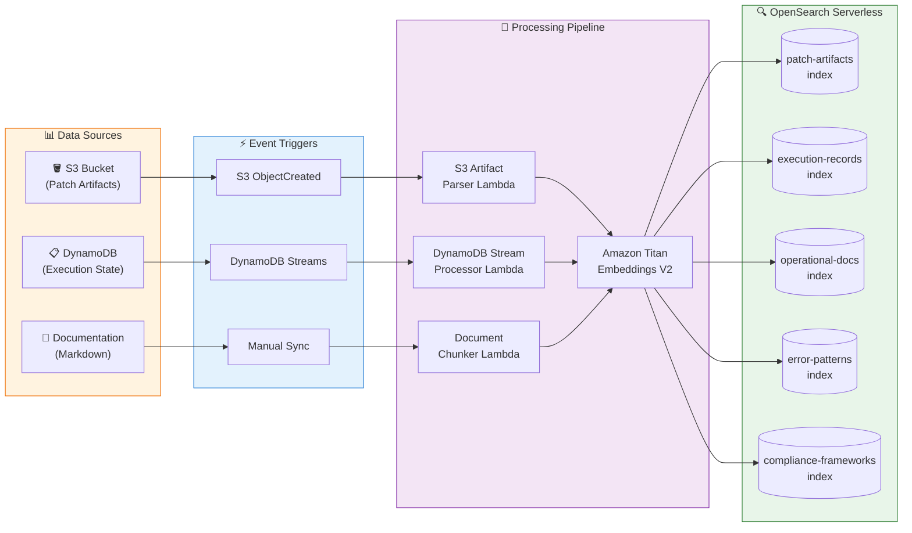

---

## 3. Agent Interaction Flow - Query Processing

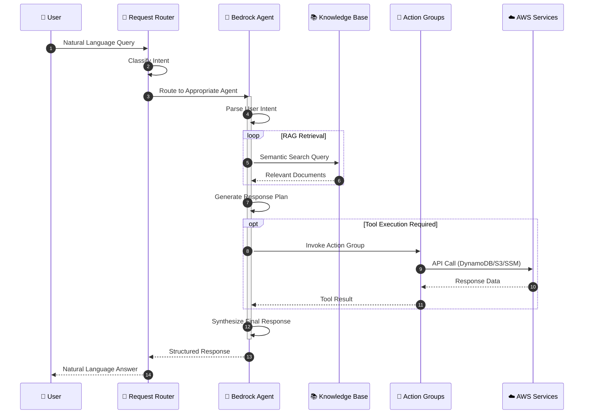

---

## 4. Audit & Compliance Agent Flow

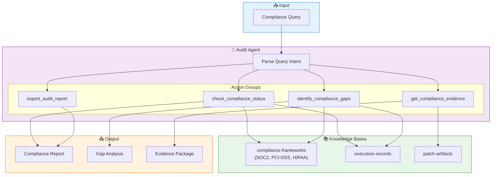

---

## 5. Anomaly Detection & Root Cause Analysis Flow

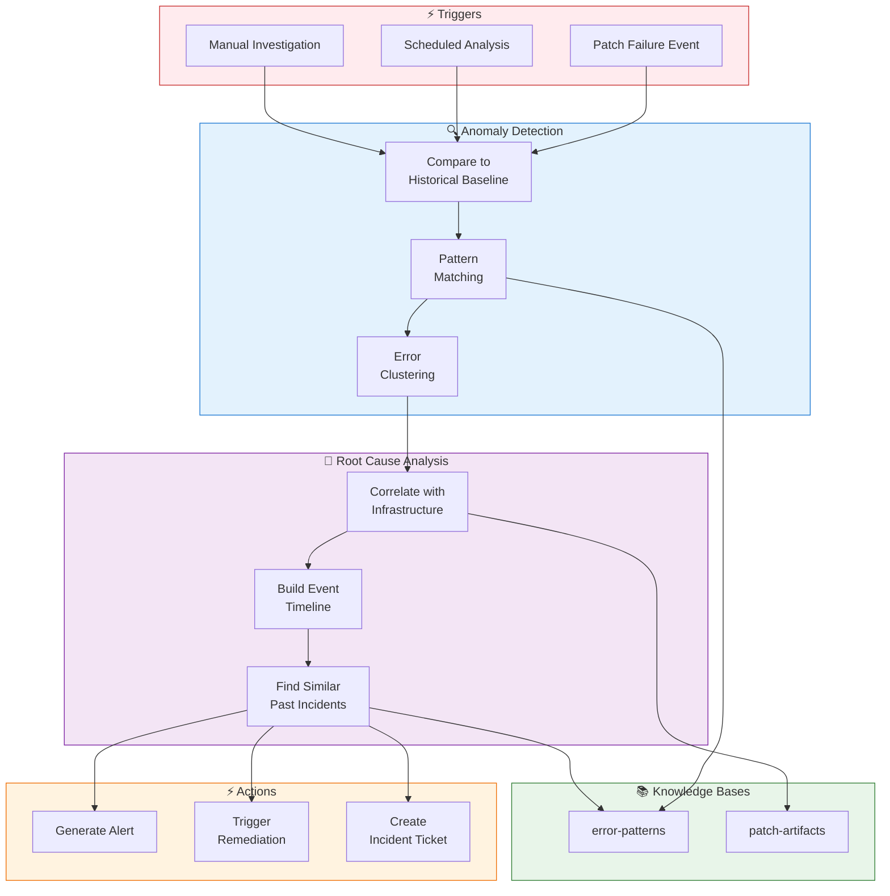

---

## 6. ChatOps Agent Conversation Flow

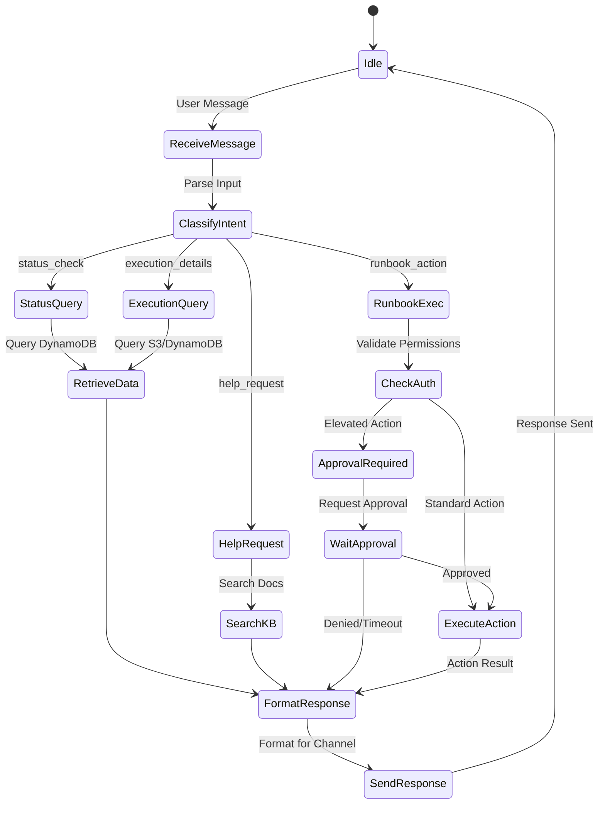

---

## 7. Auto-Remediation Agent Decision Flow

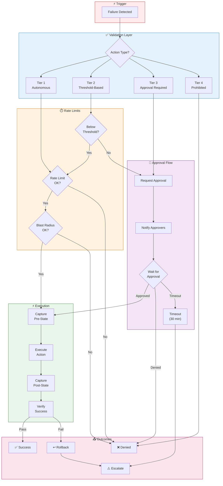

---

## 8. Multi-Agent Collaboration Pattern

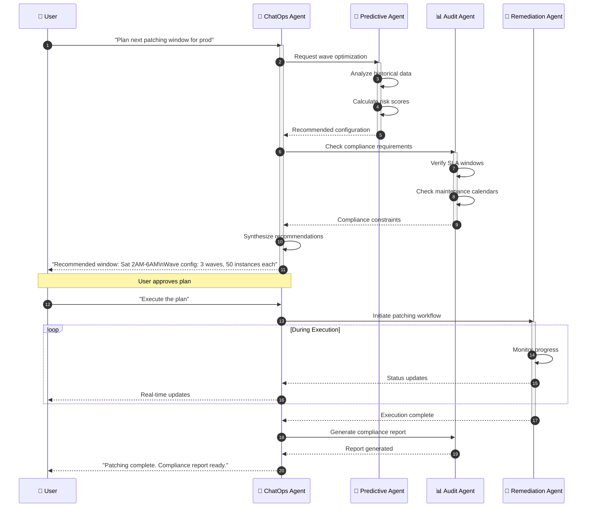

---

## 9. Predictive Planning Agent Flow

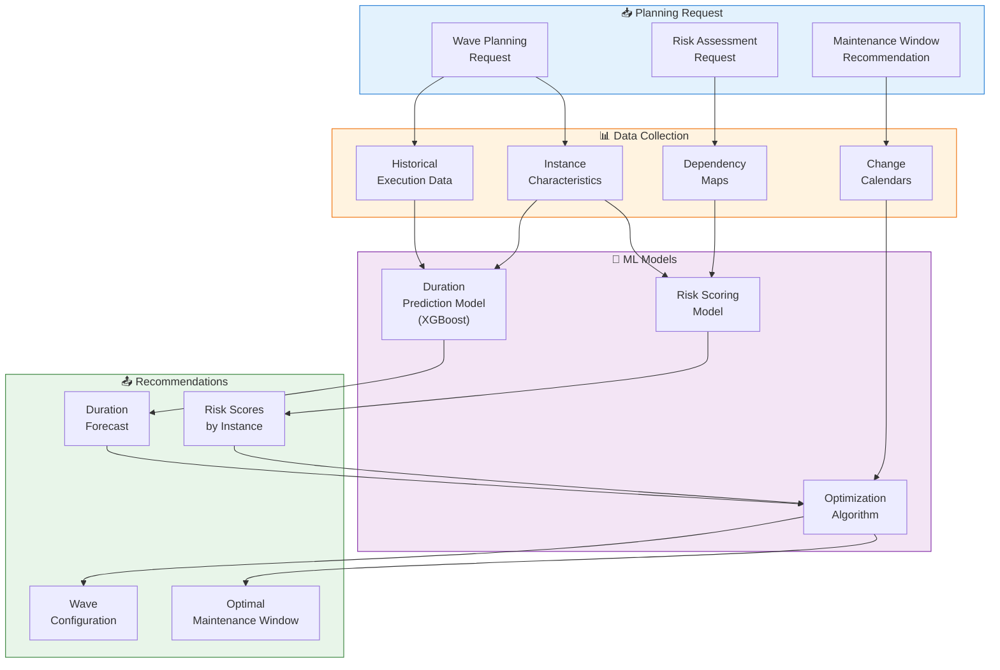

---

## 10. End-to-End Patching with Agents

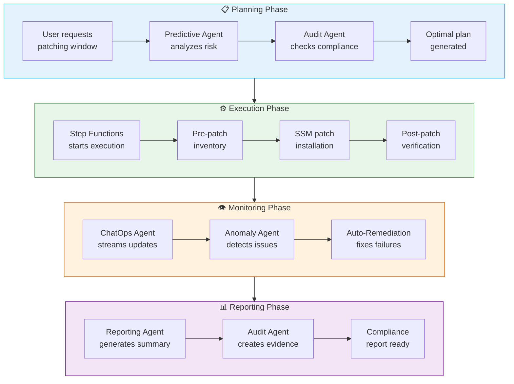

---

## 11. Agent Security & Guardrails

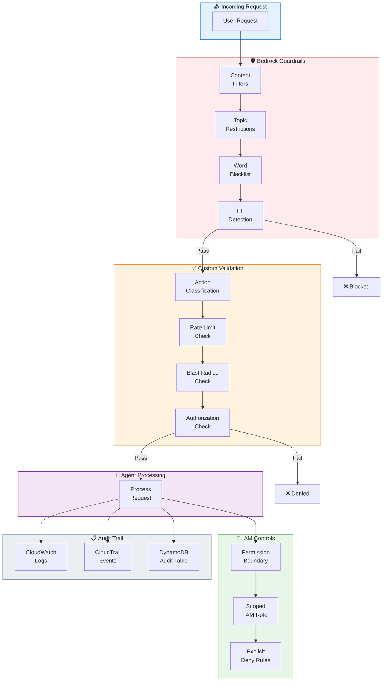

---

## 12. Agent Model Configuration Summary

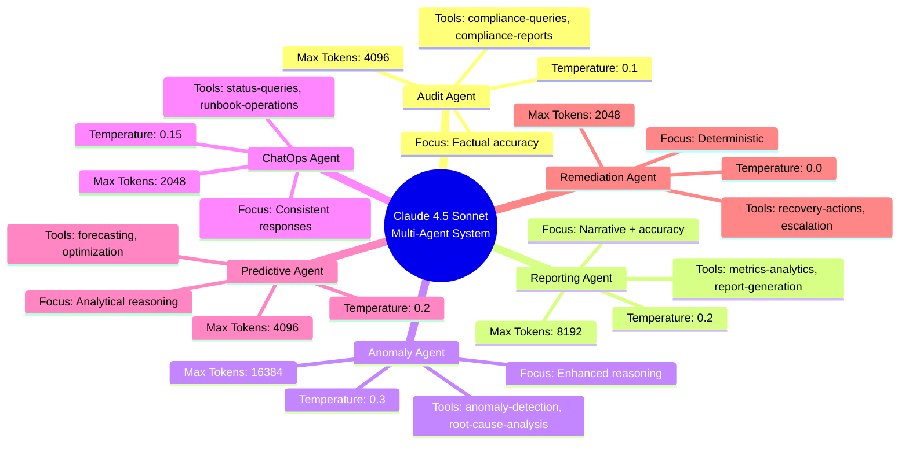

---

## Usage Notes

### Rendering Mermaid Diagrams

These diagrams can be rendered in:
- **GitHub**: Automatic rendering in markdown files
- **VS Code**: Install "Markdown Preview Mermaid Support" extension
- **Confluence**: Use Mermaid macro
- **Mermaid Live Editor**: https://mermaid.live

### Diagram Types Used

| Diagram Type | Use Case |
|--------------|----------|
| `flowchart` | System architecture, data flows |
| `sequenceDiagram` | Agent interactions, API calls |
| `stateDiagram-v2` | State machines, conversation flows |
| `mindmap` | Configuration summaries |

---

*Generated for EC2 Patching Platform Multi-Agent System*
